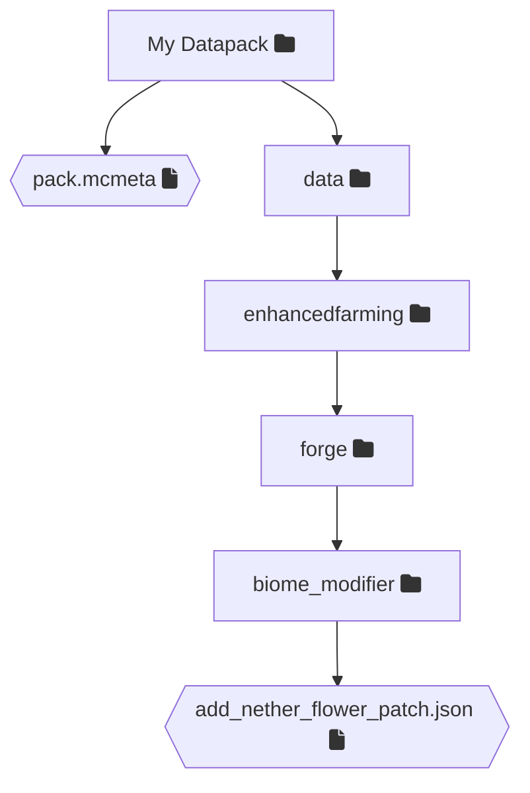

# Biome Modifiers
Biome Modifiers are a system added to Forge 1.19 for modifying biomes. They can be used to add world generation aspects or entity spawns to biomes without requiring java code.

## Disabling a biome modifier
To disable a biome modifier from a mod you will first need to find the location of the specific biome modifier json. 

You can either open the jar with a program like WinRAR or 7zip or check if the mod is open/visible source and search through the source. A biome modifier will usually be located in `data/<mod_id>/forge/biome_modifier/`

> [!NOTE]
> In NeoForge 1.20.2 and above the location changed to `data/<mod_id>/neoforge/biome_modifier`

The following steps will guide you through disabling a biome modifier:

### 1. Locate the biome modifier
* Locate the biome modifier you want to disable

### 2. Copy the folder structure
* Copy the folder structure

For this example we will disable the [add_nether_flower_patch](https://github.com/Mrbysco/Enhanced-Farming/blob/1.19/src/generated/resources/data/enhancedfarming/forge/biome_modifier/add_nether_flower_patch.json) biome modifier from `Enhanced Farming` in 1.19.2.

The biome modifier for that is located in `data/enhancedfarming/forge/biome_modifier` so in your datapack you make folders with the same names so in the end your file structure is identical:


### 3. Edit the json
* Remove everything but the type
* Change the type to `forge:none`

> [!NOTE]
> In NeoForge 1.20.2 the id for neoforge is `neoforge` so `forge:none` becomes `neoforge:none`

The file content should look as follows:
```json
{
  "type": "forge:none"
}
```