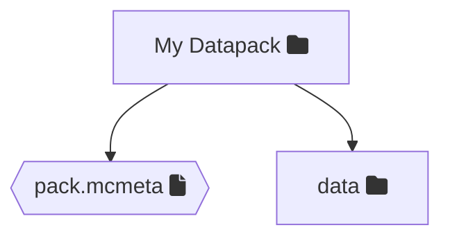
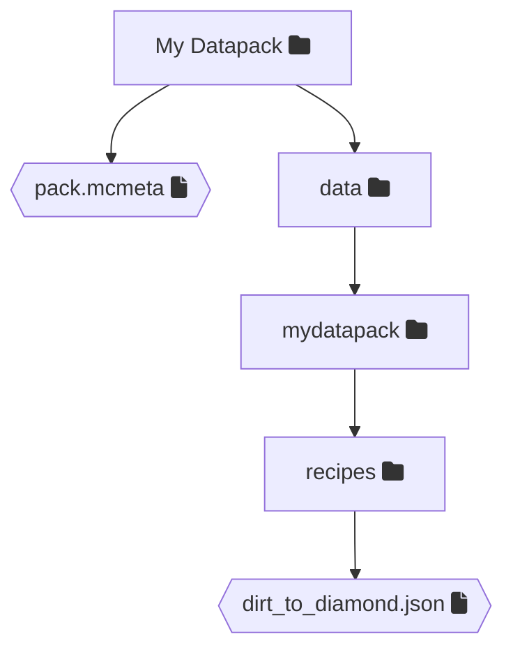

# Creating a datapack

## Steps

### Step 1: Setting up a folder
The first step to creating a Datapack is setting up a folder for the datapack. This will be the root folder of your Datapack which houses all the files. You can name the folder whatever you want so for this tutorial we'll be naming it `My Datapack`.

### Step 2: Add `pack.mcmeta`
Inside your folder you just created create a text file called `pack.mcmeta`. This file is crucial as it holds the description of your datapack and specifies which Minecraft version it supports (pack format). 
An example for the contents of the text file is as followed:
```json
{
    "pack": {
      "description": "My Dirt To Diamond recipe",
      "pack_format": 15
    }
}
```

> [!NOTE]
> A list of which Minecraft version corresponds to which pack_format can be found [here](https://minecraft.wiki/w/Pack_format#List_of_data_pack_formats).

> [!TIP]
> From 1.20.2 onwards you can specify a range of pack formats using the optional `supported_formats` field. <br>
> Examples: `18`, `[18,19]`, `{"min_inclusive": 18, "max_inclusive": 19}`
<details>
  <summary>Supported Formats example</summary>
  
```json
{
    "pack": {
      "description": "My Dirt To Diamond recipe",
      "pack_format": 18,
      "supported_formats": {
        "min_inclusive": 18,
        "max_inclusive": 19
      }
    }
}
```
</details>

### Step 3: Add the `data` folder
In the same folder as your `pack.mcmeta` needs to be a folder with the name `data`. This data folder will house your recipes, advancements, worldgen etc. 
In the end, you should end up with the following folder structure


### Step 4: Add your desired change
Now you're ready to add your desired change to the datapack. For this example, we'll add a simple recipe that turns dirt to diamonds.
To do this I'll create a folder inside of the `data` folder with the namespace I want my recipe to be under. 

**Note:** You should use a unique namespace to avoid conflicts between different datapacks (or mods) unless you're overriding.

*If you are overriding a vanilla recipe we would create a folder with the namespace `minecraft`.* 

For this example I'll be creating a folder called `mydatapack` in which I'll create a folder called `recipes` which is the namespace the game reads recipes from.
**Note:** You can find a list of vanilla namespaces [here](https://minecraft.wiki/w/Data_pack#data)

In the created `recipes` folder I'll create a text file called `dirt_to_diamond.json` with the following contents:
```json
{
  "type": "minecraft:crafting_shapeless",
  "ingredients": [
    {
      "item": "minecraft:dirt"
    }
  ],
  "result": {
    "item": "minecraft:diamond"
  }
}
```
After this step, my folder structure is as follows:


### Step 4: Zip it up
Now it's time to go back to the root of the datapack you created. Once in the root of the folder put both `pack.mcmeta` and `data` in a zip and name it.

On Windows you select the file and folder -> Right-click what you selected and click `Send to` and select `Compressed (zipped) folder` and then name the zip whatever you want to name the datapack.

(If using WinRAR you can select the files -> Right-click -> press  `Add to archive` -> name it -> Make sure the `.zip` format is selected and press `OK`.

> [!NOTE]
> I only have experience with Windows, so if using MacOS or Linux I do not currently know how to create a zip. Feel free to tell me and I'll add a section for them.


## Closing
If you followed along you've successfully created a Datapack that adds a recipe that allows you to turn a piece of dirt into a diamond. 

For information on how to add the datapack to your world see the tutorial on adding.
